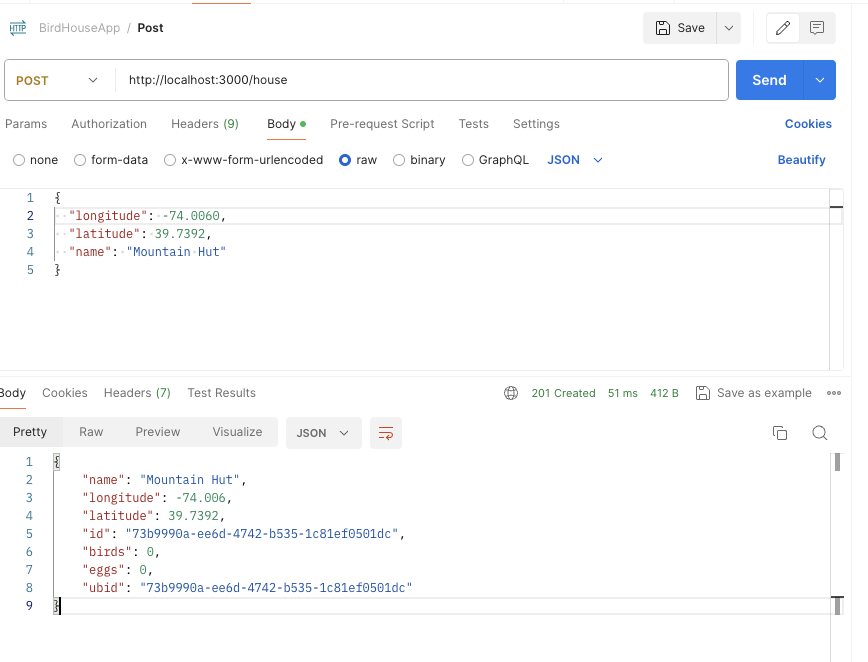
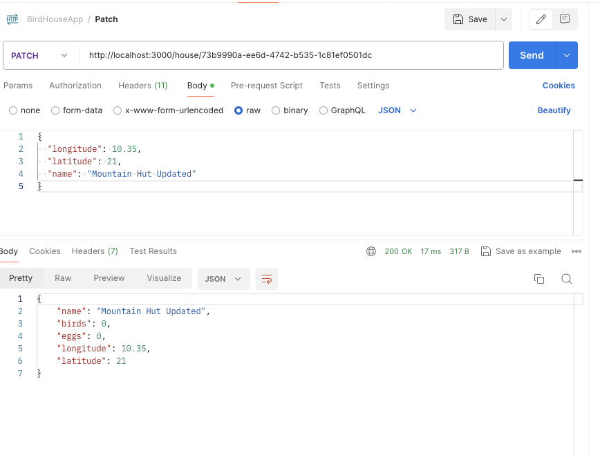
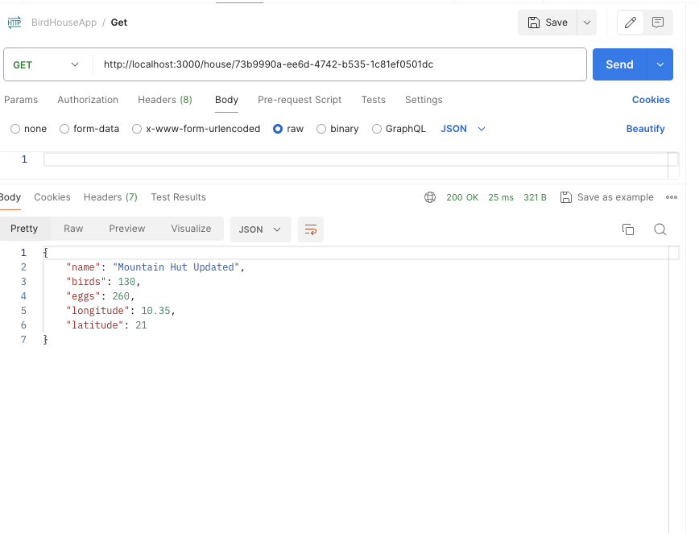
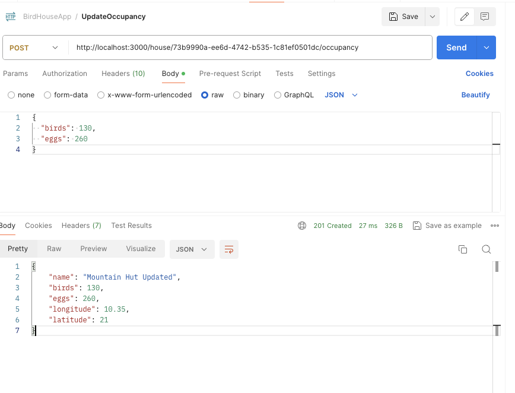

# NestJS Birdhouse API
This project is a backend application developed in NestJS for managing smart birdhouses. The API allows communication with the birdhouses to register new ones, update information, record occupancy data, and retrieve information about the birdhouses.

### Prerequisites

Make sure you have the following installed on your system:

- Node.js
- npm (Node Package Manager)
- TypeScript
- MySQL or any other supported database server

### Clone and run the application

```
git clone https://github.com/parsimeikoikai/birdhouseAPI

cd birdhouseAPI

npm install

# start project
$ npm run start

# watch mode
$ npm run start:dev
```
### Tools Used
- NestJS
- Typescript
- MySQL

### Configuration
The following environment variables should be set in your .env file:

- `USERNAME`: The username for connecting to the MySQL database.
- `PASSWORD`: The password for connecting to the  MySQLdatabase.
- `DATABASE`: The name of the MySQL database to connect to.
- `HOST`: The host address of the MySQL database server.

Ensure that you set these environment variables in your .env file with appropriate values before running your application. 

### Pruning Inactive Birdhouses
The application automatically prunes birdhouses that have not received an update in over a year. This process is implemented by running a function daily at 10 PM.

### X-UBID Header
The application uses the X-UBID header for authentication when communicating with birdhouses. This header serves as a unique identifier for each birdhouse and helps ensure secure communication between the backend and the devices.
E.g
```
X-UBID: 69e03f88-2a05-4d8d-a540-073f8910aec5
```
NB : The X-UBID header is not required in the register API endpoint, as this endpoint is responsible for registering new birdhouses in the system.

### To test out the API
- Open Postman.
- In the URL bar, enter http://localhost:3000.
- Choose the appropriate HTTP method (e.g., POST, GET, PATCH).
- Enter the endpoint you want to test after http://localhost:3000.
- Add any required headers, such as X-UBID.
- Enter the request body if applicable.
- Click on the "Send" button to make the request.


### Example Postman Requests

#### Register a New Birdhouse


#### Update Information for a Birdhouse


#### Get Information About a Birdhouse


#### Add  Birdhouse occupancy data history 
